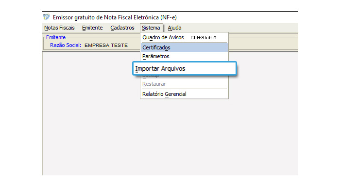

# NFeProductExtractor

**NFeProductExtractor** é um extrator de produtos de notas fiscais eletrônicas 4.0, ele é utilizado para automatizar o cadastro de produtos no emissor de notas gratuito do Sebrae 4.01.

Ele feito para funcionar com o emissor do Sebrae 4.01, que utiliza o layout de NF-e 4.0, porém ele pode facilmente ser adaptado para outras versões.

## Instalação

Instale o [python3.7.x](https://www.python.org/downloads/) para poder usar o script.

Todos os pré-requisitos já vem com o python 3.7.

## Uso

1. Insira as **notas ficais eletrônicas de produto 4.0 (NF-e 4.0)** no formato **.XML**. 
1. Escolha uma pasta para salvar os arquivos.
1. Será salvo na pasta escolhida arquivos chamados **"Products1.txt, Products2.txt, Products3.txt ..."**
1. Abra o **Emissor de NF-e gratuito do Sebrae** e selecione a sua empresa.
1. Agora vá em **Sistema** e depois em **Importar Arquivos**, como na imagem a seguir.
1. Selecione no emissor a pasta que contém os aquivos **"Products1.txt, Products2.txt, Products3.txt ..."**
1. Clique em **Importar**
1. Pronto, os produtos foram importados! :clap::clap::clap:

OBS.: Caso tenha algum erro na importação você pode entrar no arquivo .TXT gerado e editar. Você também deve contatar o desenvolvedor com um printscreen do erro para evitar problemas futuros.

## Contribuição

**Pull requests** são bem-vindos. Para grandes mudanças, abra **issue** para discutir o que você gostaria de modificar.

## Licença
[APACHE 2.0](https://github.com/xandao6/NFeProductExtractor/blob/master/LICENSE.md)
